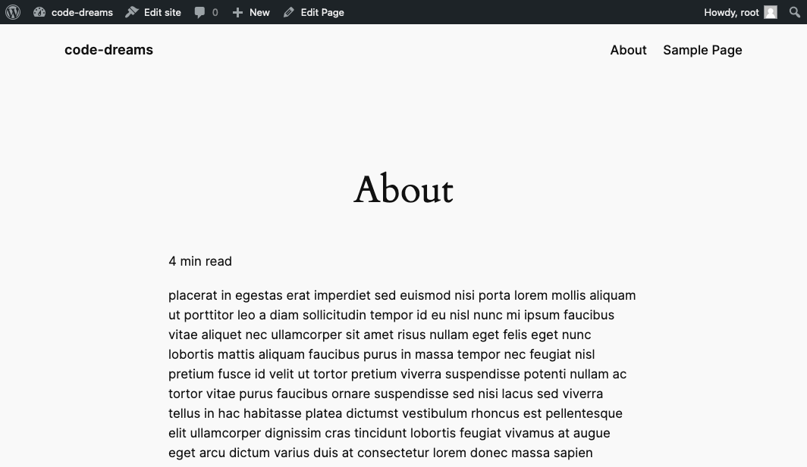
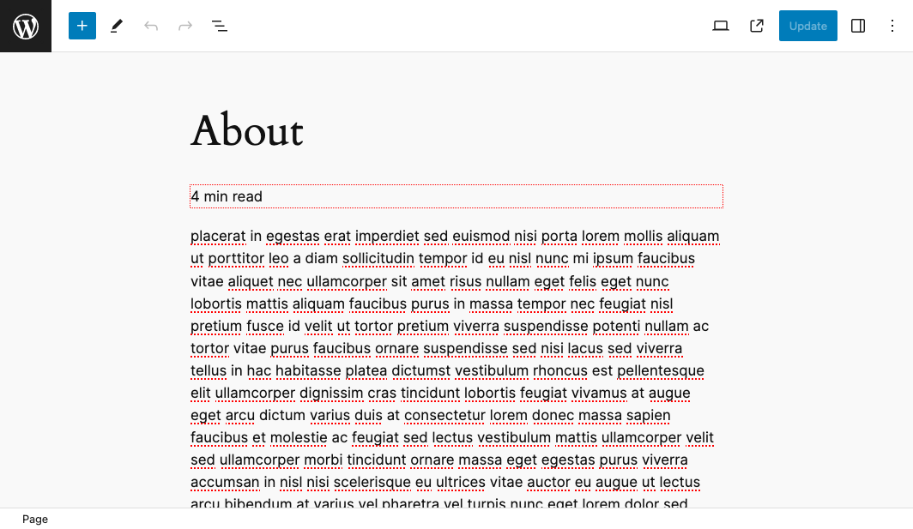

# Wordpress Reading Time Block
Displays the estimated reading time of a page/post.

#####  Web Site Preview

##### Editor Preview

### Description

This is a Wordpress Block plugin that calculates the estimated reading time of a page/post. It counts paragraph blocks words specifically.
It uses the total word count divided by 200 (words per minute) and rounds the number to the nearest integer.

### Installation

1. Upload the plugin files to the `/wp-content/plugins/reading-time-block` directory, or install the plugin through the WordPress plugins screen directly.
2. Activate the plugin through the 'Plugins' screen in WordPress
3. In Edit Mode, look under Widgets for 'Reading Time Block' to add into Editor and Save/Update.

###  Frequently Asked Questions

What type of blocks are being used to calculate the word count?

Currently, only paragraph blocks.

### Changelog

= 0.1.0 =
* Release